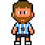
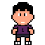
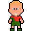
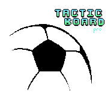

<h1 align="center">⚽ TACTICBOARD PRO</h1>

### Donde la pasión por el fútbol se encuentra con la ciencia de datos


## **LA APP QUE REVOLUCIONARÁ CÓMO VES EL FÚTBOL**


---

## 🎨 **LO QUE HEMOS CREADO**

### **PIXEL ART 100% ORIGINAL**
<p align="center">
  
  
  
</p>

**¡Cada sprite fue dibujado PIXEL POR PIXEL!** 
- Messi, Cristiano Ronaldo, Mbappé, Haaland, Neymar
- Diseñados manualmente , con horas de dedicación
- Arte digital hecho por estudiantes para estudiantes

### **LOGO PROFESIONAL DISEÑADO POR NOSOTROS**
<p align="center">
  
  <br>
  <strong>Visualización de nuestro grafo táctico en acción</strong>
</p>

**Significado del logo:** 
- Hexágono = eficiencia táctica (como panales de abeja)
- Balón = corazón del juego  
- Nodos conectados = nuestro uso de grafos
- **¡Diseño 100% original!**

---

## 🧠 **EL CEREBRO DETRÁS DE LA MAGIA: ESTRUCTURAS DE DATOS**

### **⚙️ MOTOR DE GRAFOS**
```javascript
// NUESTRO NÚCLEO TÉCNICO
class GrafoTactico {
  constructor() {
    this.nodos = new Map();      // O(1) para acceso
    this.adyacencia = new Map(); // Listas de adyacencia
  }
  
  dijkstra(origen, destino) {
    // Implementación eficiente O((V+E) log V)
  }
}
```

### **📊 ¿CÓMO APLICAMOS LO VISTO EN CLASE?**
| Estructura | Uso en TacticBoard | Ejemplo Real |
|------------|-------------------|--------------|
| **Grafos** | Modelar jugadores y pases | Jugador = nodo, Pase = arista |
| **Listas de Adyacencia** | Conexiones eficientes | ¿Quién puede pasar a quién? |
| **Dijkstra** | Ruta de pase óptima | Camino más rápido al gol |
| **BFS/DFS** | Conectividad del equipo | ¿El mediocampo está aislado? |

**¡Hacemos los grafos VISIBLES y ENTENDIBLES!**

---

## **"FIFA, PERO CON CEREBRO"**

### **¿POR QUÉ LA AMARÁN?**
1. **🎮 Se siente como videojuego** - Interfaz gamer, animaciones
2. **⚽ Habla su idioma** - Messi, Champions, datos reales  
3. **🤓 Satisface la táctica"** - Profundidad de análisis
4. **😄 Divertida inmediata** - Modo Reto adictivo
5. **👑 Decisiones que cambian resultados**

---

## 🏆 **LO QUE NOS HACE DIFERENTES**

| Competencia | Otros Proyectos | TacticBoard Pro |
|-------------|-----------------|-----------------|
| **Creatividad** | App de tareas | **FÚTBOL + VIDEOJUEGO + CIENCIA** |
| **Presentación** | Diapositivas | **LOGO, PIXEL ART, DEMO INTERACTIVA** |
| **Uso de Grafos** | Oculto | **VISIBLE, ANIMADO, EXPLICADO** |
| **Relevancia** | Genérico | **PASIÓN DE NUESTRO PÚBLICO** |

---

## 🎮 GUÍA RÁPIDA DE USO
# Primeros Pasos
1. Al abrir la app, selecciona "Modo Laboratorio"
2. Arrastra jugadores desde el panel derecho al campo
3. Asigna jugadores reales (Messi, Haaland, etc.)
4. Haz clic en "Simular Jugada" para ver el grafo en acción

# Modo Reto (Recomendado para empezar)
1. Selecciona "Modo Reto"
2. Elige un puzzle (ej: "Milagro de Anfield")
3. Sigue las instrucciones para resolver la jugada
4. Compara tu solución con la óptima calculada por el algoritmo

# Modo Analista
1. Selecciona "Modo Analista"
2. Elige la jugada legendaria que quieres estudiar
3. Encuentra sus jugadores más importantes, junto sus estadísticas.
4. Lee el análisis real del partido!

## 👥 **EL EQUIPO**

**Somos estudiantes de la Universidad Nacional** que quisimos hacer algo extraordinario.

- **Alejandra Suárez**
- **Manuel Fajardo**

---

## ⚡ **¡INSTALA Y JUEGA!**

### **Requisitos Previos**
- Node.js 16+ [Descargar](https://nodejs.org/)
- Git [Descargar](https://git-scm.com/)

### **Pasos para Ejecutar**
```bash
# 1. Clonar el repositorio
git clone https://github.com/Alejaaa7/tacticboard-pro.git

# 2. Entrar al directorio
cd tacticboard-pro

# 3. Instalar dependencias
npm install

# 4. Ejecutar la aplicación
npm start
